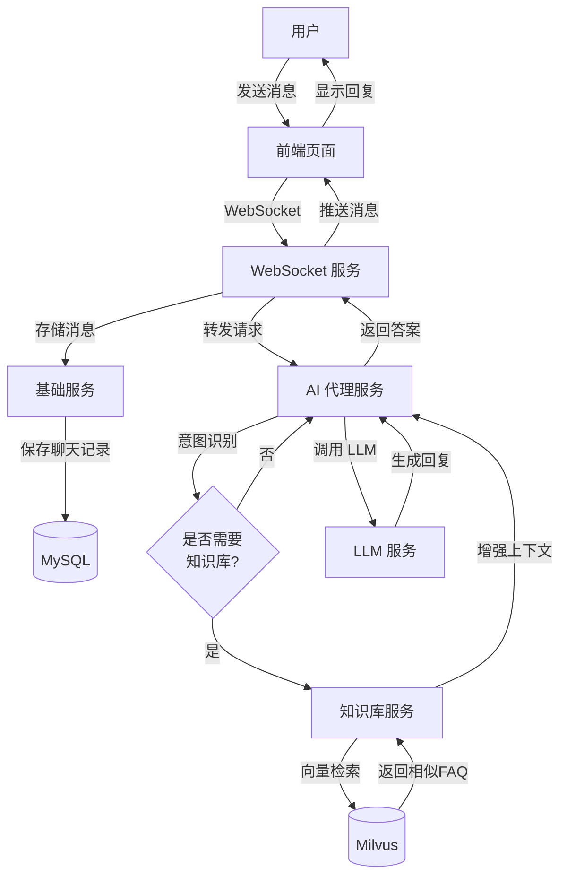
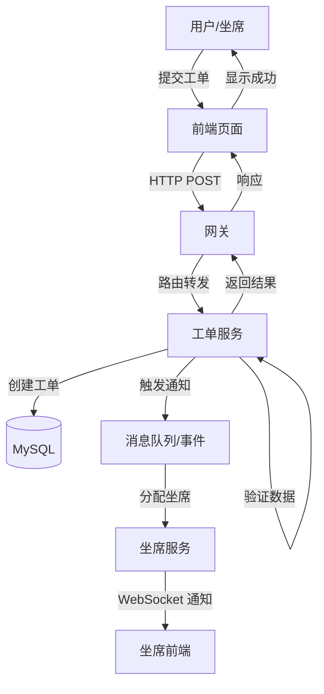
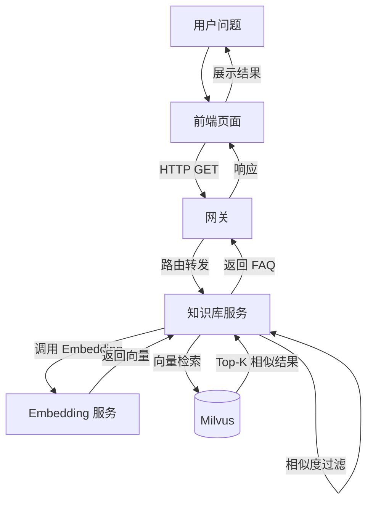
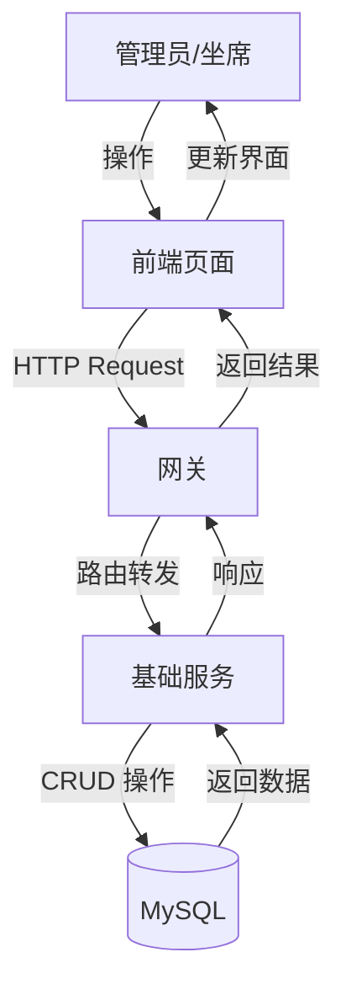
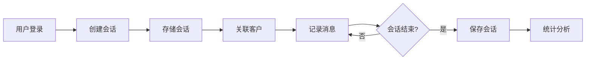

# 业务流程

业务流程示意。当前路由与实现以 [详细设计](详细设计.md) 和代码为准。

## 📋 文档信息

- **文档版本**: v1.0
- **创建日期**: 2026-06-20
- **维护者**: huangrenhui
- **最后更新**: 2026-09-05
- **状态**: 现行

---

## 📋 目录

- [核心业务流程](#-核心业务流程)
- [服务间调用关系](#-服务间调用关系)
- [数据存储策略](#-数据存储策略)
- [异步处理场景](#-异步处理场景)
- [数据安全与一致性](#️-数据安全与一致性)
- [性能优化要点](#-性能优化要点)
- [典型业务场景](#-典型业务场景)

---

## 📊 核心业务流程

### 1. 用户聊天流程



**详细步骤**:

1. **消息接收**: 用户在前端输入消息，通过 WebSocket 发送到后端
2. **会话管理**: 基础服务创建或更新聊天会话，存储消息记录
3. **意图识别**: AI 代理服务分析用户意图，判断是否需要知识库支持
4. **知识检索**: 如需知识库，将问题向量化后在 Milvus 中检索相似 FAQ
5. **LLM 调用**: 结合上下文和知识库结果，调用 LLM 生成智能回复
6. **消息推送**: 将生成的回复通过 WebSocket 实时推送给前端

**涉及服务**:
- ai-cs-websocket (实时通信)
- ai-cs-base-service (会话管理)
- ai-cs-agent (AI 对话)
- ai-cs-knowledge (知识检索)

**数据表**:
- cs_chat_session: 会话记录
- cs_chat_msg: 消息记录
- cs_knowledge_faq: 知识库 FAQ

---

### 2. 工单创建流程



**详细步骤**:

1. **工单提交**: 用户或坐席在前端填写工单信息并提交
2. **请求路由**: 网关接收请求并转发到工单服务
3. **数据验证**: 工单服务验证必填字段和业务规则
4. **持久化存储**: 将工单信息保存到数据库
5. **智能分配**: 根据工单类型和坐席负载自动分配处理人
6. **实时通知**: 通过 WebSocket 通知相关坐席有新工单
7. **结果反馈**: 返回工单 ID 和创建结果给前端

**涉及服务**:
- ai-cs-gateway (请求路由)
- ai-cs-workorder (工单管理)
- ai-cs-base-service (坐席管理)
- ai-cs-websocket (实时通知)

**数据表**:
- cs_work_order: 工单主表
- cs_agent: 坐席信息

**工单状态流转**:
```
待处理 → 处理中 → 已解决 / 已关闭
         ↓
      待跟进
```

---

### 3. 知识库检索流程 (RAG)



**详细步骤**:

1. **问题接收**: 用户输入搜索问题
2. **文本预处理**: 清洗、分词、标准化处理
3. **向量化**: 调用 Embedding 服务将文本转换为向量
4. **相似度检索**: 在 Milvus 中进行向量相似度搜索
5. **结果过滤**: 根据相似度阈值过滤低质量结果
6. **排序返回**: 按相似度降序返回 Top-K 结果

**涉及服务**:
- ai-cs-knowledge (核心检索逻辑)
- 外部 Embedding 服务 (向量化)
- Milvus (向量数据库)

**关键配置**:
```yaml
embedding:
  url: http://127.0.0.1:8000/embedding
  
milvus:
  host: localhost
  port: 19530
  collection: faq_vectors
  
search:
  top-k: 5
  similarity-threshold: 0.8
```

---

### 4. 客户管理流程



**功能模块**:

- **客户列表查询**: 分页查询、条件筛选
- **新增客户**: 录入客户基本信息
- **编辑客户**: 更新客户资料
- **删除客户**: 软删除或硬删除
- **客户详情**: 查看完整信息和历史记录

**涉及服务**:
- ai-cs-base-service (客户管理)

**数据表**:
- cs_customer: 客户信息表

---

### 5. 会话管理流程



**会话生命周期**:

1. **会话创建**: 用户首次发送消息时创建新会话
2. **上下文维护**: 存储历史消息用于上下文理解
3. **超时检测**: 长时间无活动自动标记为过期
4. **会话归档**: 定期清理或归档旧会话

**涉及服务**:
- ai-cs-base-service (会话管理)

**数据表**:
- cs_chat_session: 会话主表
- cs_chat_msg: 消息明细表

---

## 🔗 服务间调用关系

### Feign 远程调用

```
┌─────────────────────────────────────────┐
│         ai-cs-api (Feign 接口)          │
├─────────────────────────────────────────┤
│  AiAgentFeign     对话                  │
│  KnowledgeFeign   RAG / FAQ             │
│  WorkOrderFeign   工单                  │
│  OpenToolFeign    演示包工具            │
│  SessionFeign     会话 / 消息           │
│  BaseServiceFeign 客户等                │
└─────────────────────────────────────────┘
           ↑
     websocket / agent / 其它服务
```

现网聊天：前端或 WS → Agent →（咨询）KnowledgeFeign /（投诉）WorkOrderFeign /（物流退款演示包）OpenToolFeign。

### 调用示例

**基础服务不直连 LLM**。会话由 WS 或前端调 Agent；Agent 再 Feign 知识库 / 工单 / 开放工具。接口名以 `ai-cs-api` 源码为准。

---

## 💾 数据存储策略

### MySQL (关系型数据)

**存储内容**:
- 客户信息
- 坐席信息
- 聊天会话
- 聊天记录
- 工单信息
- FAQ 知识库

**优化策略**:
- 合理设计索引
- 读写分离（生产环境）
- 定期归档历史数据
- 连接池优化 (HikariCP)

### Redis (缓存)

**存储内容**:
- 会话状态
- 用户 Token
- 热点数据缓存
- 分布式锁

**优化策略**:
- 设置合理的 TTL
- 使用合适的数据结构
- 缓存穿透/击穿/雪崩防护
- 集群部署（生产环境）

### Milvus (向量数据)

**存储内容**:
- FAQ 文本向量
- 问题向量索引

**优化策略**:
- 选择合适的索引类型 (IVF_FLAT, HNSW)
- 调整 nlist 和 nprobe 参数
- 定期重建索引
- 分区管理

---

## 🔄 异步处理场景

### 1. 消息异步推送

```java
@Async
public void pushMessageToAgent(Long agentId, String message) {
    // 异步推送消息给坐席
    webSocketService.sendMessage(agentId, message);
}
```

### 2. 工单通知异步发送

```java
@EventListener
public void handleWorkOrderCreated(WorkOrderCreatedEvent event) {
    // 异步发送通知
    notificationService.sendNotification(event.getAgentId(), event.getOrder());
}
```

### 3. 向量异步生成

```java
@Async
public CompletableFuture<List<Float>> generateVector(String text) {
    // 异步调用 Embedding 服务
    List<Float> vector = embeddingUtil.embed(text);
    return CompletableFuture.completedFuture(vector);
}
```

---

## 🛡️ 数据安全与一致性

### 1. 事务管理

```java
@Transactional
public void createWorkOrder(WorkOrderDTO orderDTO) {
    // 创建工单
    workOrderMapper.insert(order);
    
    // 更新统计
    statisticsMapper.incrementOrderCount();
    
    // 发送通知
    notificationService.notify(order);
}
```

### 2. 分布式锁

```java
String lockKey = "session_lock:" + sessionId;
RLock lock = redissonClient.getLock(lockKey);

try {
    lock.lock(5, TimeUnit.SECONDS);
    // 执行会话操作
} finally {
    lock.unlock();
}
```

### 3. 数据脱敏

```java
public class CustomerVO {
    private String name;
    private String phone;  // 脱敏: 138****1234
    private String email;  // 脱敏: u***@example.com
}
```

---

## 📈 性能优化要点

### 1. 数据库优化

- ✅ 添加合适的索引
- ✅ 避免 N+1 查询
- ✅ 使用分页查询
- ✅ 批量操作代替循环

### 2. 缓存策略

- ✅ 多级缓存 (本地 + Redis)
- ✅ 缓存预热
- ✅ 被动更新 + 主动刷新
- ✅ 缓存降级策略

### 3. 向量检索优化

- ✅ 构建合适的索引
- ✅ 调整检索参数
- ✅ 向量量化压缩
- ✅ 分区并行检索

### 4. 网络优化

- ✅ 启用 GZIP 压缩
- ✅ HTTP/2 多路复用
- ✅ 连接池复用
- ✅ 异步非阻塞 IO

---

## 🎯 典型业务场景

### 场景 1: 智能客服自动应答

**流程**:
1. 用户提问 → 2. 意图识别 → 3. 知识检索 → 4. LLM 生成 → 5. 返回答案

**适用场景**: 常见问题自动回答

### 场景 2: 人工坐席介入

**流程**:
1. 用户要求人工 → 2. 创建工单 → 3. 分配坐席 → 4. 转接会话 → 5. 人工处理

**适用场景**: 复杂问题需要人工处理

### 场景 3: 知识库持续优化

**流程**:
1. 收集未解决问题 → 2. 人工标注 → 3. 添加 FAQ → 4. 向量化 → 5. 更新索引

**适用场景**: 持续提升 AI 准确率

---

## 📚 相关文档

- [系统架构](系统架构.md)
- [模块说明](模块说明.md)
- [详细设计](详细设计.md)
- [文档说明](文档说明.md)
